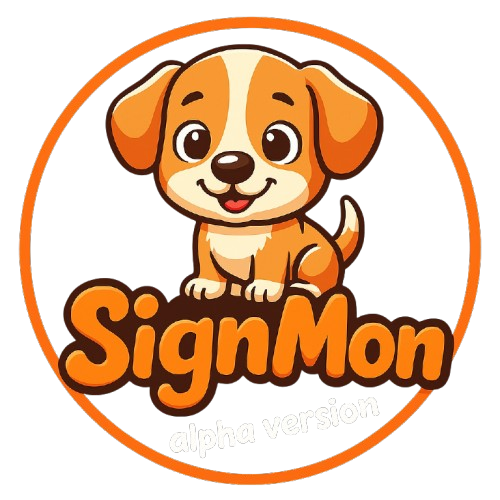
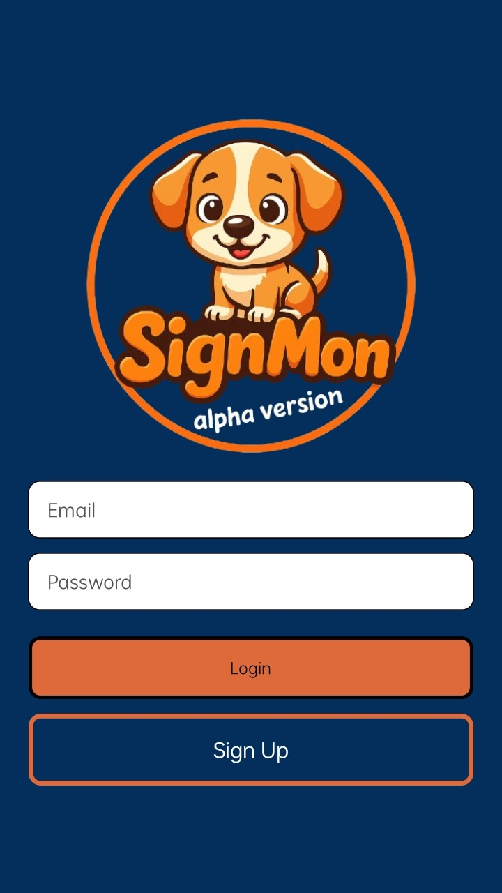
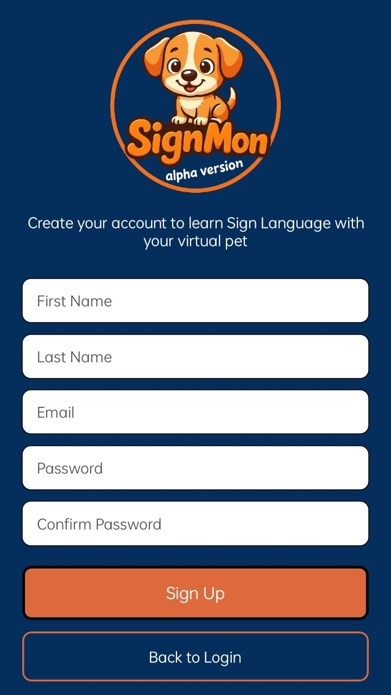
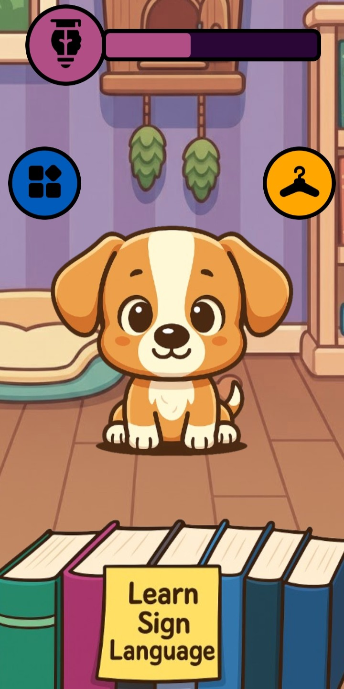
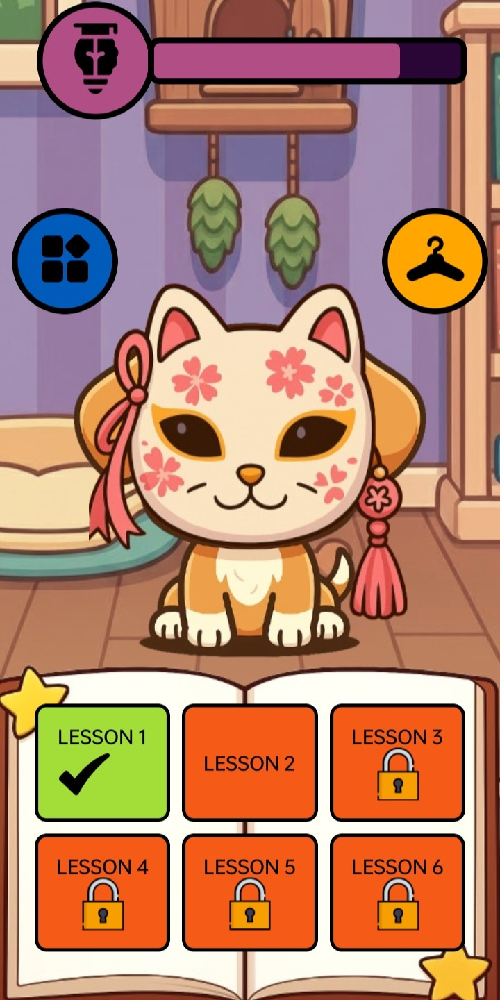

<<<<<<< HEAD
# Welcome to your Expo app 👋

This is an [Expo](https://expo.dev) project created with [`create-expo-app`](https://www.npmjs.com/package/create-expo-app).

## Get started

1. Install dependencies

   ```bash
   npm install
   ```

2. Start the app

   ```bash
   npx expo start
   ```

In the output, you'll find options to open the app in a

- [development build](https://docs.expo.dev/develop/development-builds/introduction/)
- [Android emulator](https://docs.expo.dev/workflow/android-studio-emulator/)
- [iOS simulator](https://docs.expo.dev/workflow/ios-simulator/)
- [Expo Go](https://expo.dev/go), a limited sandbox for trying out app development with Expo

You can start developing by editing the files inside the **app** directory. This project uses [file-based routing](https://docs.expo.dev/router/introduction).

## Get a fresh project

When you're ready, run:

```bash
npm run reset-project
```

This command will move the starter code to the **app-example** directory and create a blank **app** directory where you can start developing.

## Learn more

To learn more about developing your project with Expo, look at the following resources:

- [Expo documentation](https://docs.expo.dev/): Learn fundamentals, or go into advanced topics with our [guides](https://docs.expo.dev/guides).
- [Learn Expo tutorial](https://docs.expo.dev/tutorial/introduction/): Follow a step-by-step tutorial where you'll create a project that runs on Android, iOS, and the web.

## Join the community

Join our community of developers creating universal apps.

- [Expo on GitHub](https://github.com/expo/expo): View our open source platform and contribute.
- [Discord community](https://chat.expo.dev): Chat with Expo users and ask questions.
=======


# **SignMon – Alpha Version**
**SignMon** is an innovative **Sign Language learning application** built with **React Native**, designed to make learning inclusive communication both **fun and engaging**. Through its **gamified experience**, SignMon helps users learn and practice sign language in an interactive way, blending education with entertainment.  

The app not only teaches sign language effectively but also motivates learners through a **reward system**, allowing them to **customize their virtual companion** as they progress through lessons.  

---

##  **Features**
-  **Aesthetically Pleasing Interface** – Enjoy a clean, friendly, and easy-to-navigate interface that makes learning smooth and enjoyable.  
-  **Gamified Learning Experience** – Earn rewards by completing sign language lessons and unlock new customization options for your virtual pet.  
-  **Structured Sign Language Lessons** – Learn sign language efficiently through well-organized modules designed for learners of all levels.  
-  **Cross-Platform Compatibility** – Developed using React Native, ensuring smooth performance on both Android and iOS devices.  
-  **Engagement-Focused Design** – Encourages consistent learning habits through visual progress tracking and motivational rewards.  

---

## **Preview**
<p align="center" style="gap: 15px; display:flex; flex-direction:column; align-items:center;">
  
  
  
  
  
</p>

---

##  **Installation**
Follow these steps to set up and run the project on your local machine:

Make sure **Node.js** and **Git Bash** are installed on your system.

```bash
# Clone the repository
git clone https://github.com/your-username/project-name.git

# Navigate into the project directory
cd SignMon

# Install dependencies
npm install

# Start the development server
npx expo start
>>>>>>> 835444e8521b01b84d4add0892c6ed4c26fad212
